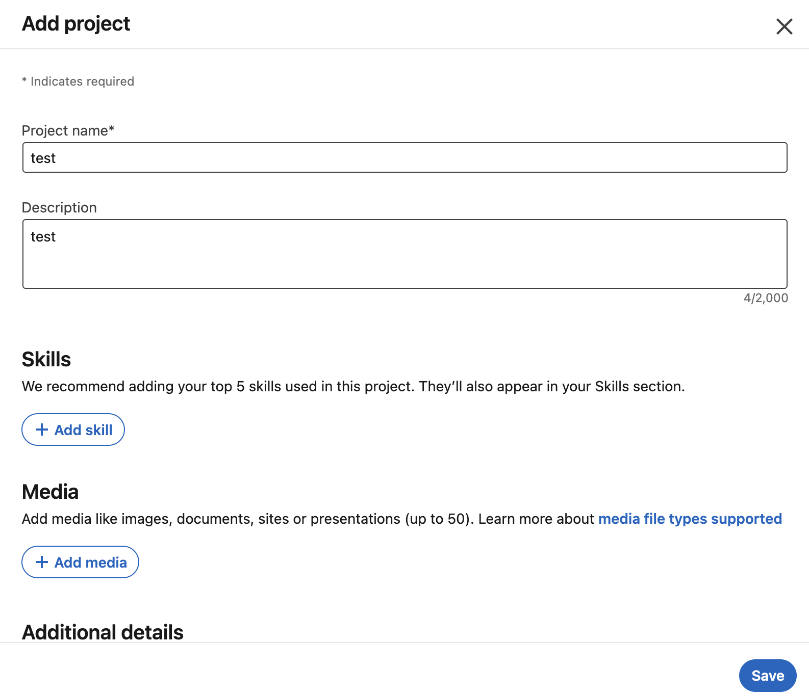
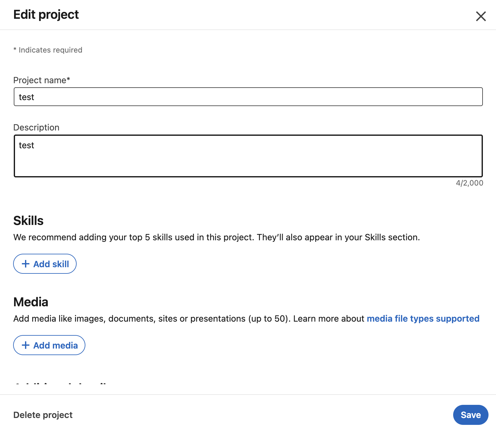
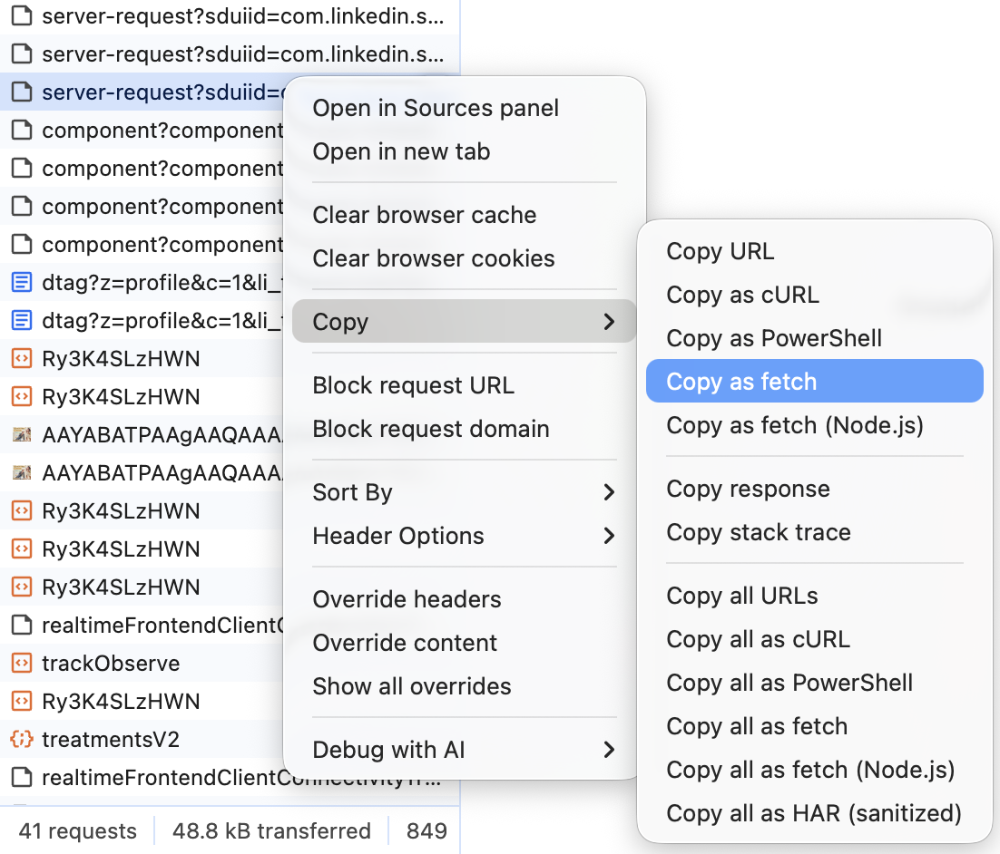
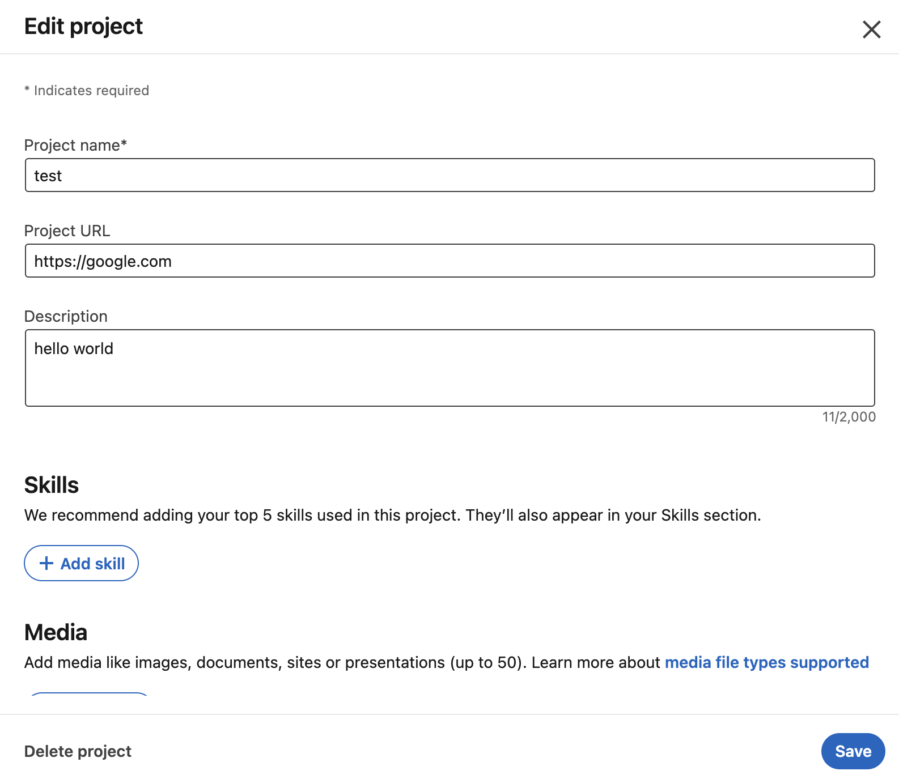
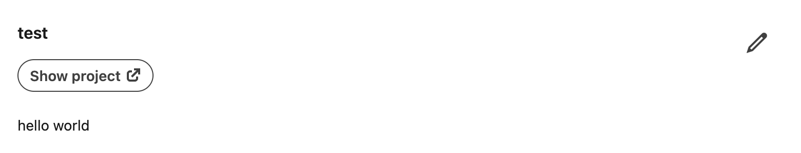

While using LinkedIn, I noticed that many people have a "Show Project" button under their project entries that links to project-related URLs. However, when actually adding a project through your own account, you will find that currently the only way to add a link is through "Media," which requires setting a title and thumbnail for the link. In some cases, this setup can feel overly cumbersome. Therefore, this tutorial will teach you how to set up the "Show Project" button on LinkedIn.

## Why Can't You Set Up the "Show Project" Button
According to information provided in <cite>a Reddit post[^1]</cite>, LinkedIn appears to have quietly removed the "Show Project" button feature (many people thought the inability to set it up was due to a bug). As a result, it is currently not possible to directly add a URL link to a project; the only option is to display links by adding "Media."

## How to Add the "Show Project" Button
I referenced the approach from <cite>this article[^2]</cite>. Although the requests sent by the new LinkedIn website are slightly different from those mentioned in the article, the overall concept still applies, so I ultimately succeeded in adding the "Show Project" button to a project.

### Step 1: Create a New Project (Skip This Step If You Already Have a Project)
You can set the content as you like; you can still modify it after completing all the steps. After confirming the information, click the save button in the bottom right corner.

### Step 2: Open Developer Tools and Switch to the Network Tab
You can open developer tools using the shortcut `F12` or by `Right-click` → `Inspect`, then switch to the Network tab.

### Step 3: Edit the Project You Just Created
You can set the content as you like; you can still modify it after completing all the steps. After confirming the information, click the save button in the bottom right corner.

### Step 4: Find the Edit Project Request in the Network Tab
After clicking save in the previous step, you will see a series of requests in the Network tab. Our target is the request starting with "server-request" that is closest to the first request starting with "component."

### Step 5: Copy the Edit Project Request as Fetch

### Step 6: Modify the Fetch Content and Execute
In the fetch content, replace both instances of `ProjectFormlegacyProjectUrl\",\"namespace\":\"MemoryNamespace\",\"value\":\"\"` with `ProjectFormlegacyProjectUrl\",\"namespace\":\"MemoryNamespace\",\"value\":\"<Project_URL>\"`, where `<Project_URL>` should be replaced with the project link you want to set.

### Step 7: Paste the Modified Fetch Code into the Browser's Console Tab and Execute
After completing this step, you can return to the LinkedIn project page, and you will find that a field for setting the project URL has appeared.

[^1]: [Did LinkedIn remove the ability to add URLs to projects on your profile?](https://www.reddit.com/r/linkedin/comments/14ichn7/did_linkedin_remove_the_ability_to_add_urls_to/) - Reddit r/linkedin
[^2]: [How to Add Project URL to LinkedIn Project 2024](https://www.linkedin.com/pulse/how-add-project-url-linkedin-2024-matthew-walloch-krshc/) - LinkedIn
