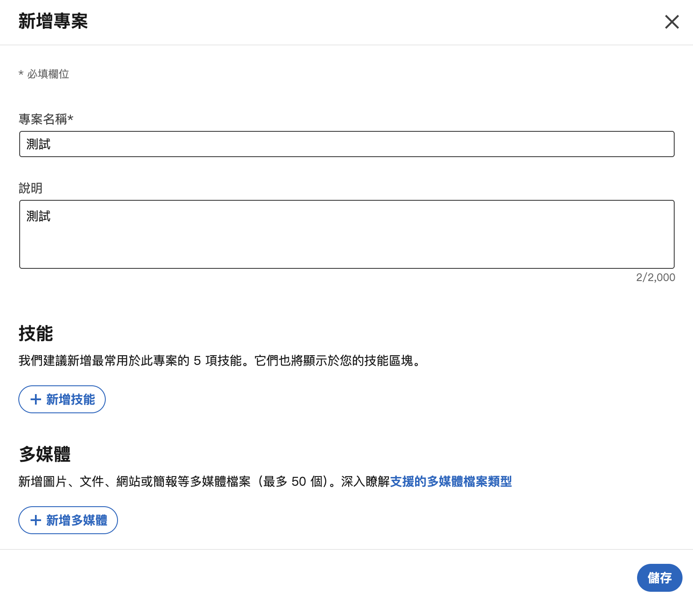
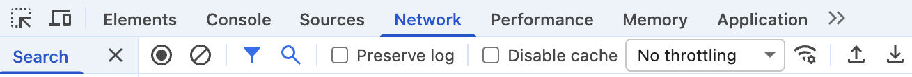
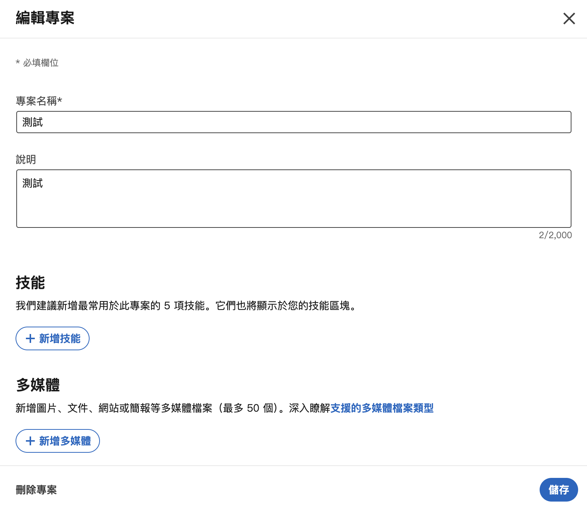
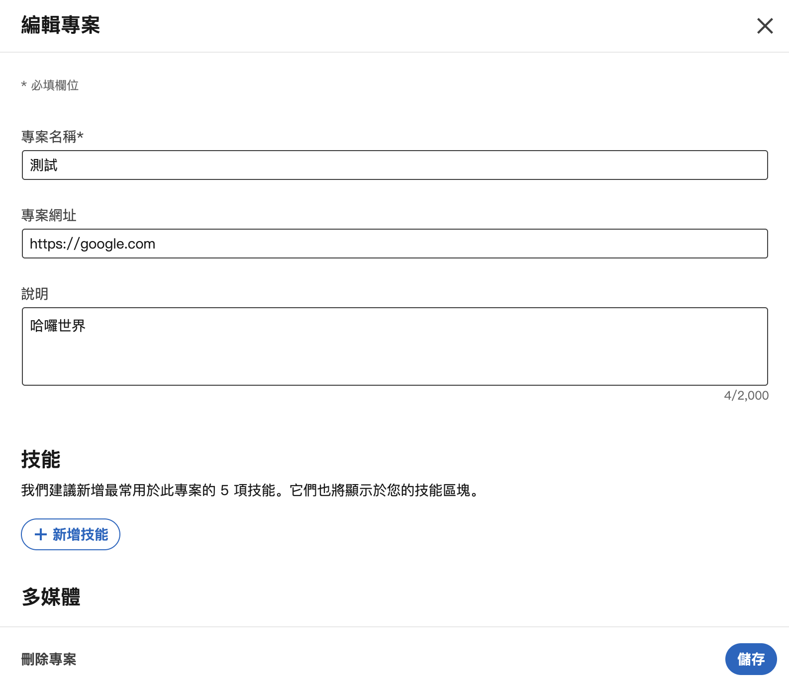

在使用 LinkedIn 時，我發現很多人專案底下的項目會有一個「顯示專案」的按鈕可以連結到專案相關的 URL，不過實際透過自己的帳號新增專案時，會發現目前只能透過「多媒體」來新增連結，且一定需要設定關於這個連結的標題和縮圖，在某些情況下，這樣的設置會使人覺得過於繁雜，因此這篇教學會教您如何在 LinkedIn 上設定「顯示專案」的按鈕。

## 為何無法設定「顯示專案」按鈕
根據 <cite>Reddit 文章[^1]</cite>所提供的資訊，LinkedIn 似乎偷偷把「顯示專案」按鈕的功能給移除了（大家還以為沒辦法設置是因為有 bug），導致目前無法直接在專案中新增 URL 連結，只能透過新增「多媒體」的方式來展示連結。

## 如何新增「顯示專案」按鈕
我參考了<cite>這篇文章[^2]</cite>的做法，雖然新版的 LinkedIn 網站所發出的 request 跟該文章提及的 request 有些微不同，但整體的概念可以沿用，所以我最終成功地在專案中新增了「顯示專案」的按鈕。

### 步驟一：新增一個專案（若已有專案可跳過此步驟）
內容可隨意設置，完成全部步驟後還可以修改，確認資訊後按下右下角儲存按鈕。

### 步驟二：開啟開發者工具並切換到 Network 分頁
可以透過快捷鍵 `F12` 或 `右鍵`→`檢查` 來開啟開發者工具，然後切換到 Network 分頁。

### 步驟三：編輯剛剛新增的專案
內容可隨意設置，完成全部步驟後還可以修改，確認資訊後按下右下角儲存按鈕。

### 步驟四：在 Network 分頁中找到編輯專案的 request
在上一步驟按下儲存後，會在 Network 分頁中看到一系列的 request，我們的目標是離第一個 component 開頭的 request 最近的那一個 server-request 開頭的 request。

### 步驟五：複製編輯專案的 request 為 fetch

### 步驟六：修改 fetch 的內容並執行
將 fetch 內容中的兩個 `ProjectFormlegacyProjectUrl\",\"namespace\":\"MemoryNamespace\",\"value\":\"\"` 替換為 `ProjectFormlegacyProjectUrl\",\"namespace\":\"MemoryNamespace\",\"value\":\"<Project_URL>\"`，其中 `<Project_URL>` 替換為您想要設定的專案連結。

### 步驟七：將修改後的 fetch 程式碼貼到瀏覽器的 Console 分頁並執行
完成這步驟後，就可以回到 LinkedIn 的專案頁面，你就會發現多了可以設定專案網址的欄位了。

[^1]: [Did LinkedIn remove the ability to add URLs to projects on your profile?](https://www.reddit.com/r/linkedin/comments/14ichn7/did_linkedin_remove_the_ability_to_add_urls_to/) - Reddit r/linkedin
[^2]: [How to Add Project URL to LinkedIn Project 2024](https://www.linkedin.com/pulse/how-add-project-url-linkedin-2024-matthew-walloch-krshc/) - LinkedIn
